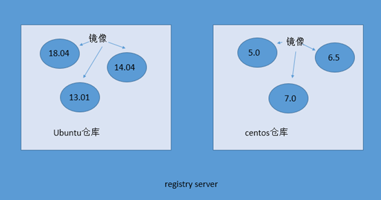

<center>Docker 核心概念及基本操作</center>
-----
[TOC]

# 1. Docker 概要

​	docker 是一种 Linux 容器技术。容器有效的将由单个操作系统管理的资源划分到孤立的组中，以便更好的在组之间平衡有冲突的资源使用需求。可简单理解为一种沙盒 。<font color=red>每个容器内运行一个应用，不同的容器之间相互隔离，容器之间也可以建立通信机制。容器的创建和停止都十分快速，资源需求远远低于虚拟机</font>。传统虚拟化方式是在硬件层面实现虚拟化，需要有额外的虚拟机管理应用和虚拟机操作系统层。而docker容器是在操作系统层面上实现虚拟化，直接复用本地主机操作系统，更加轻量。


# 2. Docker 核心概念

- **仓库（Repository）**：每个仓库存放某一类镜像，每个镜像用 `tag` 区分。
- **镜像（Image）**：类似虚拟机镜像。
- **容器（Container）**：类似 Linux 系统环境，运行和隔离应用。容器从镜像启动的时候，docker会在镜像的最上一层创建一个可写层，镜像本身是只读的，保持不变。

**仓库、镜像、容器关系图**如下：




# 3. Docker 常用命令


```bash
### Containers Commands ###
docker ps				# List runing containers
docker ps -a			# List all containers 

docker rm         		# Remove one or more containers

docker create     		# Create a new container
docker commit			# Create a new image from a container's changes
docker rename     		# Rename a container
docker run        		# Run a command in a new container

docker kill        		# Kill one or more running containers
docker start       		# Start one or more stopped containers
docker stop        		# Stop one or more running containers
docker restart			# Restart one or more containers
# Management Commands
docker container CMD	# Manage containers

### Images Commands ###
docker images			# List images

docker rmi				# Remove one or more images

docker pull				# Pull an image or a repository from a registry
docker push				# Push an image or a repository to a registry

docker load				# Load an image from a tar archive or STDIN
docker save				# Save one or more images to a tar archive
docker search			# Search the Docker Hub for images
# Management Commands
docker image CMD 		# Mange images
```

```bash
# 创建并运行一个容器
docker run --runtime nvidia -it -p 8888:8888 -p 6006:6006 -v $(pwd)/Tensorflow:/home/Tensorflow --name tf tensorflow/tensorflow:latest-gpu-py3 bash

# 下次运行时
docker start -i tf

# 参数解析
docker run 								# creat and run a container
--runtime nvidia						# nvidia-docker
-it										# for interactive
-p 8888:8888							# for Jupyter notebook
-p 6006:6006							# for Tensorboard
-v $(pwd)/Tensorflow:/home/Tensorflow	# shared floders
--name tf								# container name
tensorflow/tensorflow:latest-gpu-py3	# image name
bash 									# command run on container
```

